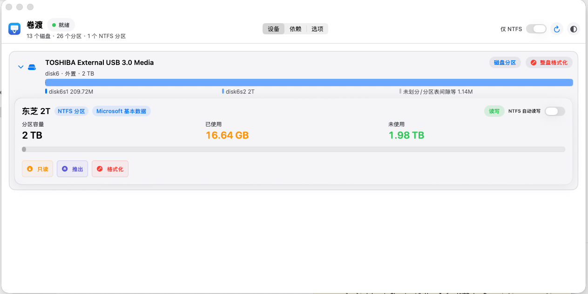

# Volferry（卷渡）

Volferry 是一个面向 macOS 的 NTFS 磁盘管理工具，提供：

- NTFS 分区检测与状态展示
- NTFS 只读/读写挂载切换
- 分区级与整盘级格式化能力
- 状态栏悬浮窗快捷操作
- 开机自启与自动读写（按分区勾选）

目标是把「插盘 -> 挂载 -> 读写 -> 安全移除」这条链路做成一个可视化、低门槛、可追踪的流程。

---

## 功能概览

### 1) 设备管理

- 自动识别磁盘、分区、文件系统类型、挂载点和读写状态
- 设备页支持磁盘树展开，显示分区容量、已用/可用空间
- 对启动盘相关高风险操作做了保护（隐藏危险按钮）

### 2) NTFS 挂载能力

- 系统挂载（`diskutil mount`）：通常为只读
- 读写挂载（`ntfs-3g + macFUSE`）：支持读写切换
- 只读还原、推出卷、安全移除（含 sudo 流程）

### 3) 自动读写

- 支持「全局总开关 + 分区级勾选」
- 分区勾选后按稳定标识（优先 `VolumeUUID`）持久化
- 后台检测到目标分区后自动尝试读写挂载
- 提供二次确认与风险提示（钥匙串授权、清空勾选等）

### 4) 状态栏模式

- 菜单栏常驻入口，支持悬浮窗查看 NTFS 分区
- 可在悬浮窗直接执行：挂载/读写/推出/格式化/安全移除
- 自动读写开关已与主窗口状态实时同步

### 5) 依赖检测与修复引导

- 内置 `macFUSE`、`ntfs-3g`、`mkntfs` 状态检测
- 提供一键修复入口与手动安装指引

---

## 界面截图

### 主窗口



### 状态栏悬浮窗


---

## 运行环境

- macOS 14.0+
- Xcode 15+
- Apple Silicon / Intel Mac

---

## 依赖说明

### 必需组件（读写/格式化相关）

- [macFUSE](https://macfuse.io/)
- `ntfs-3g-mac`（建议通过 Homebrew）

示例：

```bash
brew install --cask macfuse
brew install gromgit/fuse/ntfs-3g-mac
```

> 首次安装 macFUSE 后，通常需要在「系统设置 -> 隐私与安全性」允许系统扩展；部分场景需重启。

---

## 本地开发

### 打开工程

```bash
open Volferry.xcodeproj
```

### 命令行构建

```bash
xcodebuild \
  -project "Volferry.xcodeproj" \
  -scheme "Volferry" \
  -configuration Debug \
  -destination "platform=macOS" \
  build
```

---

## GitHub Actions 自动构建

仓库已配置工作流：

- 文件：`.github/workflows/macos-build.yml`
- 触发条件：
  - push 到 `main`
  - PR 到 `main`
  - 手动触发（workflow_dispatch）
- 构建平台：`macos-14`
- 构建命令：`xcodebuild ... CODE_SIGNING_ALLOWED=NO build`

---

## 使用流程（推荐）

1. 连接 NTFS 磁盘并在设备页确认分区出现
2. 若只读，先系统挂载再切读写
3. 在「选项」启用全局自动读写
4. 回到分区卡片勾选「NTFS 自动读写」
5. 需要时使用状态栏悬浮窗进行快速操作

---

## 权限与安全提示

- 读写挂载、分区、格式化会触发 sudo 能力，请谨慎执行
- 保存管理员密码到钥匙串后，系统可能在自动流程中弹出钥匙串访问授权
- 关闭全局自动读写会清空所有分区勾选
- 整盘格式化会清空整盘数据，请先备份

---

## 版本

- 当前版本号：`0.0.1`

---

## 许可证

本项目采用 [MIT License](LICENSE)。
